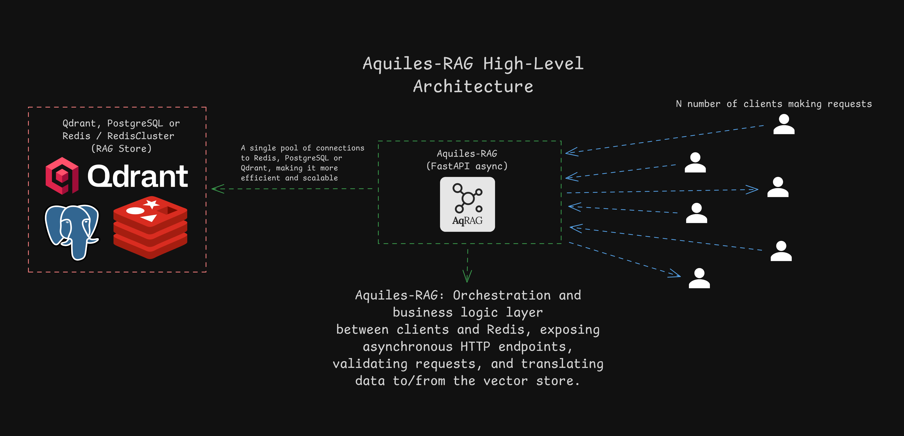

<h1 align="center">Aquiles-RAG</h1>

<div align="center">
  
</div>

<p align="center">
  <strong>High-performance Retrieval-Augmented Generation (RAG) with MCP Server support on Redis, Qdrant or   PostgreSQL (pgvector)</strong><br/>
  🚀 FastAPI • Redis / Qdrant / PostgreSQL • Async • Embedding-agnostic • MCP Server
</p>

<p align="center">
  <a href="https://pypi.org/project/aquiles-rag/"></a>
  <a href="https://aquiles-ai.github.io/aqRAG-docs/">📖 Documentation</a>
  <a href="https://pypi.org/project/aquiles-rag/"></a>
</p>

## 📑 Table of Contents

1. [Features](#features)
2. [Tech Stack](#tech-stack)
3. [Requirements](#requirements)
4. [Installation](#installation)
5. [Configuration & Connection Options](#configuration--connection-options)
6. [Usage](#usage)
   * [CLI](#cli)
   * [REST API](#rest-api)
   * [Python Client](#python-client)
   * [UI Playground](#ui-playground)
7. [Architecture](#architecture)
8. [License](#license)

## ⭐ Features

* 📈 **High Performance**: Vector search powered by Redis HNSW, Qdrant, or PostgreSQL with pgvector.
* 🛠️ **Simple API**: Endpoints for index creation, insertion, querying, and optional re-ranking.
* 🔌 **Embedding-agnostic**: Works with any embedding model (OpenAI, Llama 3, HuggingFace, etc.).
* 💻 **Interactive Setup Wizard**: `aquiles-rag configs` walks you through full configuration for Redis, Qdrant, or PostgreSQL.
* ⚡ **Sync & Async clients**: `AquilesRAG` (requests) and `AsyncAquilesRAG` (httpx) with `embedding_model` and `metadata` support.
* 🤖 **MCP Server Integration**: Built-in Model Context Protocol server for seamless AI assistant integration.
* 🧩 **Extensible**: Designed to integrate into ML pipelines, microservices, or serverless deployments; supports an optional re-ranker stage for improved result ordering.

## 🛠 Tech Stack

* **Python 3.9+**
* [FastAPI](https://fastapi.tiangolo.com/)
* [Redis](https://redis.io/), [Qdrant](https://qdrant.tech/) or **PostgreSQL + pgvector** as vector store
* [NumPy](https://numpy.org/)
* [Pydantic](https://pydantic-docs.helpmanual.io/)
* [Jinja2](https://jinja.palletsprojects.com/)
* [Click](https://click.palletsprojects.com/) (CLI)
* [Requests](https://docs.python-requests.org/) (sync client)
* [HTTPX](https://www.python-httpx.org/) (async client)
* [Platformdirs](https://github.com/platformdirs/platformdirs) (config management)

## ⚙️ Requirements

1. **Redis** (standalone or cluster) — *or* **Qdrant** (HTTP / gRPC) — *or* **PostgreSQL** with the `pgvector` extension.
2. **Python 3.9+**
3. **pip**

> **Optional**: run Redis locally with Docker:
>
> ```bash
> docker run -d --name redis-stack -p 6379:6379 redis/redis-stack-server:latest
> ```

## 🚀 Installation

### Via PyPI (recommended)

```bash
uv pip install aquiles-rag
```

### From Source (optional)

```bash
git clone https://github.com/Aquiles-ai/Aquiles-RAG.git
cd Aquiles-RAG

python -m venv .venv
source .venv/bin/activate
pip install -r requirements.txt

# optional development install
pip install -e .
```

## 🔧 Configuration & Connection Options

Configuration is persisted at:

```
~/.local/share/aquiles/aquiles_config.json
```

### Setup Wizard (recommended)

The previous manual per-flag config flow was replaced by an interactive wizard. Run:

```bash
aquiles-rag configs
```

The wizard prompts for everything required for either **Redis**, **Qdrant**, or **PostgreSQL** (host, ports, TLS/gRPC options, API keys, admin user). At the end it writes `aquiles_config.json` to the standard location.

> The wizard also includes optional re-ranker configuration (enable/disable, execution provider, model name, concurrency, preload) so you can activate a re-ranking stage that scores `(query, doc)` pairs after the vector store returns candidates.

### Manual config (advanced / CI)

If you prefer automation, generate the same JSON schema the wizard writes and place it at `~/.local/share/aquiles/aquiles_config.json` before starting the server (or use the `deploy` pattern described below).


## 📖 Usage

### CLI

* **Interactive Setup Wizard (recommended)**:

```bash
aquiles-rag configs
```

* **Serve the API**:

```bash
aquiles-rag serve --host "0.0.0.0" --port 5500
```

* **MCP Server**:
```bash
aquiles-rag mcp-serve --host "0.0.0.0" --port 5500 --transport "sse"
```

* **Deploy with bootstrap script** (pattern: `deploy_*.py` with `run()` that calls `gen_configs_file()`):

```bash
# Redis example
aquiles-rag deploy --host "0.0.0.0" --port 5500 --workers 2 deploy_redis.py

# Qdrant example
aquiles-rag deploy --host "0.0.0.0" --port 5500 --workers 2 deploy_qdrant.py

# PostgreSQL example
aquiles-rag deploy --host "0.0.0.0" --port 5500 --workers 2 deploy_postgres.py

# MCP Example (Deployment is only compatible with the SSE transport)

aquiles-rag deploy-mcp --host "0.0.0.0" --port 5500 deploy_mcp_postgres.py
```

> The `deploy` command imports the given Python file, executes its `run()` to generate the config (writes `aquiles_config.json`), then starts the FastAPI server.

### REST API — common examples

1. **Create Index**

```bash
curl -X POST http://localhost:5500/create/index \
  -H "X-API-Key: YOUR_API_KEY" \
  -H 'Content-Type: application/json' \
  -d '{
    "indexname": "documents",
    "embeddings_dim": 768,
    "dtype": "FLOAT32",
    "delete_the_index_if_it_exists": false
  }'
```

2. **Insert Chunk (ingest)**

```bash
curl -X POST http://localhost:5500/rag/create \
  -H "X-API-Key: YOUR_API_KEY" \
  -H 'Content-Type: application/json' \
  -d '{
    "index": "documents",
    "name_chunk": "doc1_part1",
    "dtype": "FLOAT32",
    "chunk_size": 1024,
    "raw_text": "Text of the chunk...",
    "embeddings": [0.12, 0.34, 0.56, ...]
  }'
```

3. **Query Top-K**

```bash
curl -X POST http://localhost:5500/rag/query-rag \
  -H "X-API-Key: YOUR_API_KEY" \
  -H 'Content-Type: application/json' \
  -d '{
    "index": "documents",
    "embeddings": [0.78, 0.90, ...],
    "dtype": "FLOAT32",
    "top_k": 5,
    "cosine_distance_threshold": 0.6
  }'
```

> The API supports an optional re-ranking stage (configurable in the server). When enabled, the typical flow is: vector search → candidate filtering/metadata match → optional re-ranker scores pairs to improve ordering. (See configuration wizard to enable/disable and set re-ranker options.)

### Python Client

#### Sync client

```python
from aquiles.client import AquilesRAG

client = AquilesRAG(host="http://127.0.0.1:5500", api_key="YOUR_API_KEY")

# Create an index (returns server text)
resp_text = client.create_index("documents", embeddings_dim=768, dtype="FLOAT32")

# Insert chunks using your embedding function
def get_embedding(text):
    return embedding_model.encode(text)

responses = client.send_rag(
    embedding_func=get_embedding,
    index="documents",
    name_chunk="doc1",
    raw_text=full_text,
    embedding_model="text-embedding-v1"  # optional metadata sent with each chunk
)

# Query the index (returns parsed JSON)
results = client.query("documents", query_embedding, top_k=5)
print(results)
```

#### Async client

```python
import asyncio
from aquiles.client import AsyncAquilesRAG

client = AsyncAquilesRAG(host="http://127.0.0.1:5500", api_key="YOUR_API_KEY")

async def main():
    await client.create_index("documents_async")
    responses = await client.send_rag(
        embedding_func=async_embedding_func,   # supports sync or async callables
        index="documents_async",
        name_chunk="doc_async",
        raw_text=full_text
    )
    results = await client.query("documents_async", query_embedding)
    print(results)

asyncio.run(main())
```

**Notes**

* Both clients accept an optional `embedding_model` parameter forwarded as metadata — helpful when storing/querying embeddings produced by different models.
* `send_rag` chunks text using `chunk_text_by_words()` (default ≈600 words / ≈1024 tokens) and uploads each chunk (concurrently in the async client).
* If the re-ranker is enabled on the server, the client can call the re-rank endpoint after receiving RAG results to re-score/re-order candidates.

### MCP Example

```python
import asyncio
import os
import openai
from openai import AsyncOpenAI as OpenAI
from agents import Agent, Runner, function_tool
from agents.mcp import MCPServerSse
from aquiles.client import AsyncAquilesRAG
from typing import Literal

openai.api_key = os.getenv("OPENAI_API_KEY")

async def get_emb(text: str):
    client = OpenAI()

    resp = await client.embeddings.create(
        input=text,
        model="text-embedding-3-small"
    )

    return resp.data[0].embedding

async def send_info(index: str, name_chunk: str, raw_text: str, dtype: Literal["FLOAT32", "FLOAT64", "FLOAT16"]):
    client = AsyncAquilesRAG(host="https://aquiles-deploy.onrender.com",api_key=os.getenv("AQUILES_API_KEY", "dummy-api-key")) # MCP server can now be deployed in Render

    result = await client.send_rag(get_emb, index, name_chunk, raw_text, dtype)

    return result

async def query(index: str, text: str, dtype: Literal["FLOAT32", "FLOAT64", "FLOAT16"] = "FLOAT32", 
                top_k: int = 5, cosine_distance_threshold: float = 0.6,):
    client = AsyncAquilesRAG(host="https://aquiles-deploy.onrender.com", api_key=os.getenv("AQUILES_API_KEY", "dummy-api-key")) # MCP server can now be deployed in Render
    embedding = await get_emb(text)
    result = await client.query(index=index, embedding=embedding, dtype=dtype, top_k=top_k, cosine_distance_threshold=cosine_distance_threshold)
    return result

async def main():

    mcp_server = MCPServerSse({"url": "https://aquiles-deploy.onrender.com/sse", "headers": { # MCP server can now be deployed in Render
        "X-API-Key": os.getenv("AQUILES_API_KEY", "dummy-api-key")
    }})
    await mcp_server.connect()

    agent = Agent(
        name="Aquiles Assistant",
        instructions="""
        You are a helpful assistant with access to tools on the MCP server for managing and querying a vector database (Aquiles RAG).
        Use the tools to answer user queries efficiently.

        ## Available Tools:

        ### 1. **send_info** - Store text in vector database
        Use this tool whenever you need to add text+embedding to the vector store.
        
        **Signature:** `send_info(index: str, name_chunk: str, raw_text: str, dtype: Literal["FLOAT32","FLOAT64","FLOAT16"])`
        
        **Parameters:**
        - `index`: Target index name where the chunk will be stored
        - `name_chunk`: A short identifier or name for the chunk being stored
        - `raw_text`: The text content to be vectorized and stored
        - `dtype`: Numeric dtype for storage (one of "FLOAT32", "FLOAT64", "FLOAT16")
        
        **Behavior:**
        - This tool internally computes the embedding (via the internal `get_emb` helper) and sends the chunk to Aquiles
        - IMPORTANT: When a task requires generating or storing vector representations, invoke **send_info** with the appropriate parameters
        - If **send_info** fails at any point (embedding computation or sending to Aquiles), stop execution and report exactly where it failed and why

        ### 2. **query_rag** - Search/query the vector database
        Use this tool to search for relevant information stored in the vector database based on semantic similarity.
        
        **Signature:** `query_rag(index: str, text: str, dtype: Literal["FLOAT32","FLOAT64","FLOAT16"] = "FLOAT32", top_k: int = 5, cosine_distance_threshold: float = 0.6)`
        
        **Parameters:**
        - `index`: The index name to search in (must be the same index where data was stored)
        - `text`: The query text to search for (will be converted to an embedding internally)
        - `dtype`: Numeric dtype used when the index was created (must match the storage dtype, default: "FLOAT32")
        - `top_k`: Number of most similar results to return (default: 5)
        - `cosine_distance_threshold`: Minimum similarity score threshold (0.0 to 1.0, default: 0.6). Results below this threshold are filtered out
        
        **Behavior:**
        - This tool internally computes the query embedding and searches for the most similar vectors
        - Returns results sorted by similarity (highest first)
        - Only returns results above the cosine_distance_threshold
        - IMPORTANT: Always use the same `dtype` that was used when storing the data with `send_info`
        
        **Usage Examples:**
        - To search for information: `query_rag(index="my_docs", text="What is machine learning?")`
        - To get more results: `query_rag(index="my_docs", text="AI applications", top_k=10)`
        - To filter low-quality matches: `query_rag(index="my_docs", text="query", cosine_distance_threshold=0.8)`

        ## Workflow Guidelines:

        1. **Storing Data:** Use `send_info` to add documents/chunks to the vector database
        2. **Searching Data:** Use `query_rag` to find relevant information based on user queries
        3. **Consistency:** Always use the same `dtype` for both storing and querying within the same index
        4. **Error Handling:** If any tool fails, report the exact error and suggest corrective actions
        
        ## Important Notes:
        - The embedding model used is `text-embedding-3-small` (1536 dimensions)
        - Ensure the `index` parameter is consistent between `send_info` and `query_rag` operations
        - The `dtype` must match between storage and query operations for the same index
        """,
        mcp_servers=[mcp_server],
        tools=[function_tool(send_info, name_override="send_info"),
                function_tool(query, name_override="query_rag")],
        model="gpt-5"
    )

    prompt = """Execute this test step by step. After EACH step, immediately proceed to the next:

        STEP 1: Test database connection
        STEP 2: Create 2 indexes with random names, when creating the indexes, set the embeddings dimension to 1536.
        STEP 3: List all indexes (then IMMEDIATELY continue)
        STEP 4: Add 8 sentences using send_info (2 per topic: cars, food, sports, tech, music)
        STEP 5: Query RAG with one topic (Create one query that is similar to one of the sentences you sent to the RAG and another that is on the same topic, but does not resemble the sentences you sent)
        STEP 6: Delete 1 index
        STEP 7: Report all results

    IMPORTANT: Do NOT wait after step 3. Continue immediately to step 4.
    Stop only if a step fails."""

    result = await Runner.run(agent, prompt)
    print(result.final_output)

    await mcp_server.cleanup()

if __name__ == "__main__":
    asyncio.run(main())
```

### UI Playground

Open the web UI (protected) at:

```
http://localhost:5500/ui
```

Use it to:

* Run the Setup Wizard link (if available) or inspect live configs
* Test `/create/index`, `/rag/create`, `/rag/query-rag`
* Access protected Swagger UI & ReDoc after logging in

## 🏗 Architecture



1. **Clients** (HTTP/HTTPS, Python SDK, or UI Playground) make asynchronous HTTP requests.
2. **FastAPI Server** — orchestration and business logic; validates requests and translates them to vector store operations.
3. **Vector Store** — Redis (HASH + HNSW/COSINE search), Qdrant (collections + vector search), or PostgreSQL with `pgvector` and `pgcrypto` (manual DB preparation required).
4. **Optional Re-ranker** — when enabled, a re-ranking component scores `(query, doc)` pairs to improve final ordering.

## ⚠️ Backend differences & notes

* **Metrics / `/status/ram`**: Redis offers `INFO memory` and `memory_stats()` — for Qdrant the same Redis-specific metrics are not available (the endpoint will return a short message explaining this). For PostgreSQL, metrics exposed differ from Redis and Qdrant; check your Postgres monitoring tooling for memory and indexing statistics.
* **Dtype handling**: Server validates `dtype` for Redis (converts embeddings to the requested NumPy dtype). Qdrant accepts float arrays directly — `dtype` is informational/compatibility metadata. For PostgreSQL+pgvector, ensure the stored vector dimension and any normalization required for cosine/inner product are handled by your ingestion pipeline.
* **gRPC**: Qdrant can be used over HTTP or gRPC (`prefer_grpc=true` in the config). Ensure your environment allows gRPC outbound/inbound as needed.
* **PostgreSQL note**: Aquiles-RAG does **not** run automatic migrations for Postgres — create the `pgvector` extension, tables and indexes manually (or via your own migration tool) before using Postgres as a vector store.

## 🔎 Test Suite

See the `test/` directory for automated tests:

* client tests for the Python SDK
* API tests for endpoint behavior
* `test_deploy.py` for deployment / bootstrap validation

> If you add Postgres to CI, prepare the DB (create `pgvector` extension and required tables/indexes) in your test fixtures since there are no automatic migrations.

## 📄 License

[Apache License](LICENSE)
